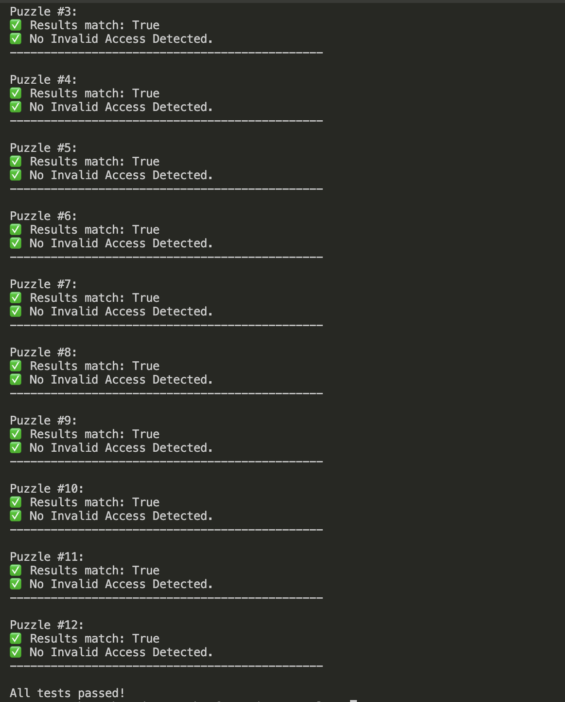
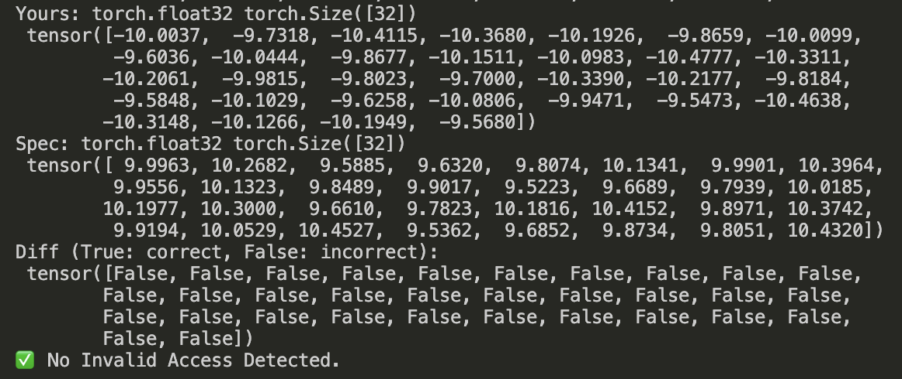
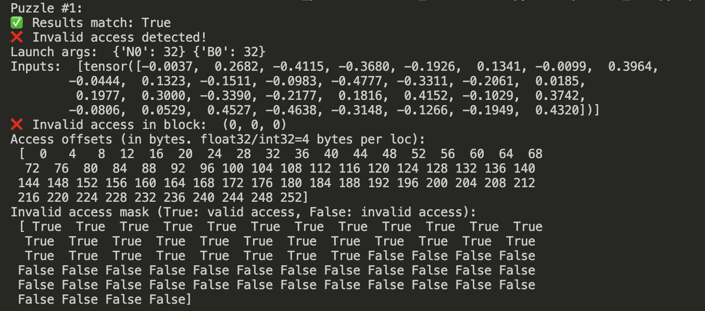

# Triton Puzzles Lite

Modified from [Triton-Puzzles](https://github.com/srush/Triton-Puzzles/) by Sasha Rush and others, which is a good educational notebook for learning Triton compiler. Triton Puzzles Lite is a lite version of Triton Puzzles, decoupling it from many unnecessary dependencies and making it more accessible for beginner users.

## Get Started


#### Installation

You only need to install `torch`. Triton and NumPy are installed when installing PyTorch. Other dependencies are fully removed from the original version. All puzzles are executed on **CPU through Triton interpreter**. So any GPU-related configuration is not necessary (i.e. You can just install torch-cpu) -- but you can also run them in GPU.

```bash
# In your Python virtual environment / conda environment
pip install torch==2.5.0
# Check triton version: triton==3.1.0
```

Note: there is a known version issue that you may encounter. See [Known Issues](#known-issues).

#### Do Puzzles

The main content is integrated in this single file: `puzzles.py`. Read through it in order and complete the exercises along the way, and you will have completed the challenge!

Run puzzles (Remeber to open the Triton interpreter mode):
```bash
# Run all puzzles. Stop at the first failed one
TRITON_INTERPRET=1 python3 puzzles.py -a
# Run on GPU
python3 puzzles.py -a
# Only run puzzle 1
TRITON_INTERPRET=1 python3 puzzles.py -p 1
# More arguments, refer to help
python3 puzzles.py -h
```

Run answers (The answer is placed in `puzzles_ans.py` for reference):
```bash
TRITON_INTERPRET=1 python3 puzzles_ans.py -a
```



Check `puzzles.md` for the puzzle descriptions w/ pictures.

## Debug

1. You can use `print` to directly print the intermediate values in Triton interpreter mode (CPU) to debug. For GPU, use `tl.static_print` or `tl.device_print` instead. See the [offcial documentation for debug Ops](https://triton-lang.org/main/python-api/triton.language.html#debug-ops).

2. For better debugging, we enhance the test function to print more information. If your output is different from the expected output, we will print them as well as the positions of the different values:



3. And if invalid memory access is detected, we will print the memory access information, including access offsets and valid/invalid mask. (This is implemented by hooking the Triton interpreter, so only in CPU mode):



## Changes

- For minimal dependency, we remove the visualization part of Triton Puzzles and turn it from a Jupyter notebook to a Python script.

- Fix some problem descriptions. 
    - Puzzle 6: `(i, j)` should be `(j, i)`, and `x` should be two-dimensional.
    - Puzzle 9: The original description and notations are confusing. Change to the correct version.
    - Puzzle 10: Change the index var `k` to `l` to avoid confusing with the kernel `k`.
    - Puzzle 12: Add some notes about the difference of `shift` in the formula and the real tests.

- Small modifications to the test function & triton-viz interpreter, for better debugging.

- Some minor modifications in the puzzles code (Mainly for better readability, e.g. variable naming).

## Known Issues
<a id="known_issues"></a>

- Puzzle 11, 12 fail in GPU mode.

- There are some campatibility issues with Triton interpreter and NumPy 2.0. To check it, you can first run demos to see whether the results are correct:
    ```bash
    TRITON_INTERPRET=1 python3 puzzles.py -i
    ```
    If the results of Demo 1 look like:
    ```
    Demo1 Output: 
    [0 1 2 3 4 5 6 7]
    [0. 0. 0. 0. 0. 0. 0. 0.]
    ```
    Then you should first fix your version problem. You can read [this issue](https://github.com/SiriusNEO/Triton-Puzzles-Lite/issues/1) for a detailed solutions.
